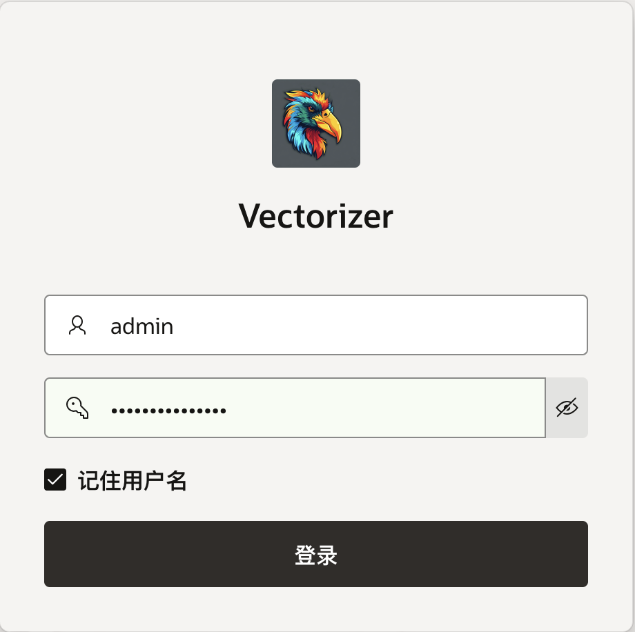
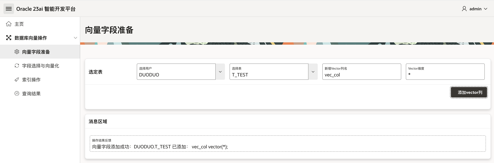

# Vectorizer
 Oracle 23ai Vectorizer with APEX

# 利用 APEX 打造 Oracle 23ai 智能开发平台

Oracle 23ai 有很多新功能，但用户痛点是不会用。

因此计划开发一个适合小白的图形化界面`Oracle 23ai智能开发平台`，过程中也能学习APEX的玩法。

本篇先拿Oracle数据库向量操作相关功能起步，这个子项目就姑且起名为`Vectorizer`吧，初期先实现这四个基础功能模块：

- 1.向量字段准备
- 2.字段选择与向量化
- 3.索引操作
- 4.查询结果

**功能模块细化描述：**
1.给选定表添加一个向量字段；
2.针对表中的某字段向量化存储到刚刚添加的向量字段中；
3.创建hnsw索引；
4.查询结果能够显示：1）向量化字段信息；2）hnsw索引情况信息；

## 1.向量字段准备

给选定表添加一个向量字段。

实现可以通过LOV列表选择指定用户、指定表，然后用户输入自己要新增的Vector类型的列名，指定Vector维度，默认值是`*`，用户也可以按需输入1~65535之间的任意整数值。

点击`添加vector列`的按钮即可实现给指定表添加一个向量字段类型的新列。在按钮下方的消息区域能够看到操作结果反馈，是否添加成功。

**这里有关APEX的设计是：**
- 两个LOV列表之间是需要设置级联关系，实现自动刷新
- 这个按钮我使用的是添加动态操作，执行服务器端代码，选择PL/SQL
- 上面同时要注意设置好要提交的项和要返回的项
- 为了实现消息区域的自动刷新，添加了第2个动态操作，受影响的元素选定消息区域

## 2.字段选择与向量化

针对表中的某字段向量化存储到刚刚添加的向量字段中。

这里通过LOV列表选择指定用户、指定表、选择内容列、选择向量列。然后点击`指定列向量化`按钮，将选定内容列的内容向量化并存储在选定向量列中。

注意这里会有点慢，耐心等待消息区域出现类似上图的信息后，才算成功。

**这里关键的设计是：**
- 调试期间，Embedding遇到超过限制的最大tokens问题
- 在PL/SQL代码中设计逐行更新
- 截断文本避免超过 token 限制

## 3.索引操作

创建 HNSW（Hierarchical Navigable Small World）索引：

这里参数看着比较多，其实关键只需要指定你要建立的索引名、然后就是选择用户名、表名、向量列名即可，其他参数有需要就微调下，没特殊需求或不太了解就默认，我这里都给设了默认值。

选择好之后直接点击`创建HNSW索引`按钮。

**这里关键的设计是：**
- 创建报错 ORA-51961: 向量内存区域空间不足。
- 只需数据库中设置`VECTOR_MEMORY_SIZE`参数，指定专门的内存空间。
- 这里的按钮我采用了另外一种方式，添加处理，执行PL/SQL代码，处理设置了成功消息和错误消息
- 处理调用的存储过程在DB中封装成一个包，方便后续添加其他复杂的过程或函数

## 4.查询结果

查询结果能够显示：1）向量化字段信息；2）hnsw索引情况信息；

目前只需要选择用户和表即可列出对应的向量字段&向量索引信息：

**这里关键的设计是：**
- 选择内容列和选择向量列目前只是预留
- 选择表对应的页项`:P6_TABLE`添加了两个动态操作
- 分别刷新下面的两个交互式报表，实现查询信息实时联动
